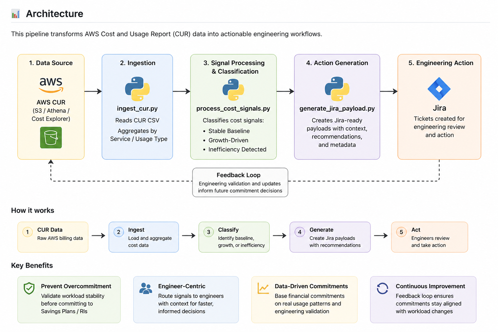

# FinOps Cost-to-Action Pipeline



> Turning AWS billing data into engineering action, so FinOps decisions are based on real workload behavior, not assumptions.

### What this shows
 
- Cost visibility alone doesn’t drive outcomes, action does
- Engineers validate workload behavior before financial commitments  
- FinOps decisions are based on real usage patterns, not assumptions  
- A feedback loop ensures continuous alignment between cost and architecture
- > A closed-loop FinOps system that transforms AWS cost signals into engineering action and feeds validation back into commitment strategy.

This project demonstrates how to turn AWS Cost and Usage Report (CUR) data into actionable engineering workflows.

Instead of stopping at cost visibility, this pipeline:
- Ingests CUR data using Python
- Classifies cost signals (baseline, growth, inefficiency)
- Generates Jira-ready action items
- Enables engineers to validate workload stability and planned changes before FinOps commits to Savings Plans or Reserved Instances

## Why this matters

Most teams struggle with the gap between **cost insight and execution**.

This system bridges that gap by:
- Routing cost signals to engineers with context
- Preventing overcommitment to unstable workloads
- Ensuring inefficiencies are fixed before commitments are made

## Operating Principle

Engineers don’t purchase Savings Plans, but they control the workload behavior that makes commitments safe.

## Run the pipeline

```bash
python3 src/ingest_cur.py
python3 src/process_cost_signals.py
python3 src/generate_jira_payload.py

## What this demonstrates

- FinOps as an operating system (not just reporting)
- Translation of cost data into engineering workflows
- Separation of baseline vs variable usage for commitment strategy
- Prevention of overcommitment through workload validation loops

## Example Output

```json
{
  "summary": "SP/RI Recommendation: EC2 cost signal",
  "description": "Stable baseline detected. Validate workload before commitment.",
  "labels": ["finops", "commitment"]
}
